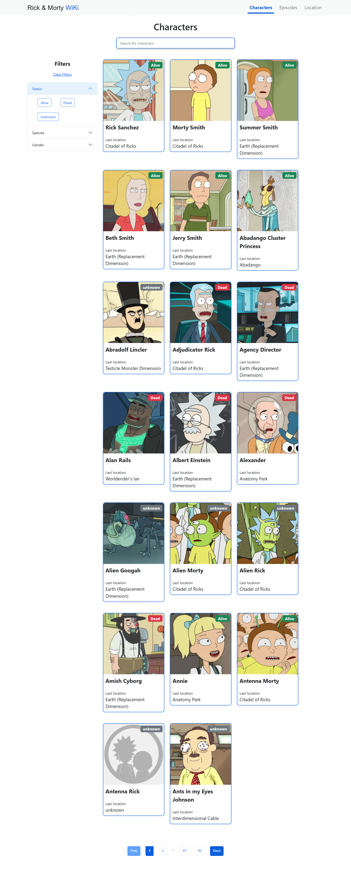

## Ricky & Morty Wikia

#### Resources about the project:
- Build in ReactJS
- Fetch info from Ricky and Morty API: 
    - https://rickandmortyapi.com/
- Using SASS and Bootstrap
- React Paginate:
    - https://www.npmjs.com/package/react-paginate
- Search bar to search for characters
- Filters to filter status, species and gender

---

#### How to run the project

```
npm install

npm start
```
---                
### 👁️ [View Online](https://frontiago-react-rick-morty.vercel.app/)

---

